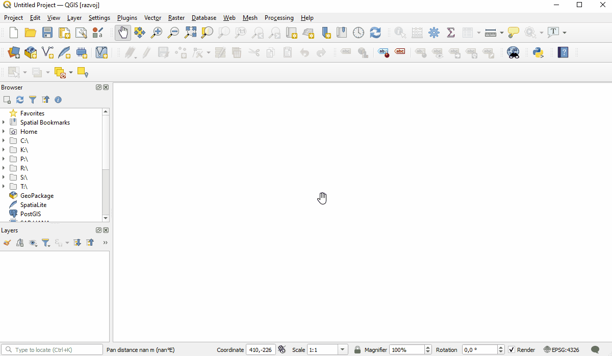

<!--
*** Thanks for checking out the Best-README-Template. If you have a suggestion
*** that would make this better, please fork the repo and create a pull request
*** or simply open an issue with the tag "enhancement".
*** Don't forget to give the project a star!
*** Thanks again! Now go create something AMAZING! :D
-->

[![Contributors][contributors-shield]][contributors-url]
[![Forks][forks-shield]][forks-url]
[![Stargazers][stars-shield]][stars-url]
[![Issues][issues-shield]][issues-url]
[![MIT License][license-shield]][license-url]
[![LinkedIn][linkedin-shield]][linkedin-url]

<!-- PROJECT LOGO -->
 

  

  <h3 align="center">iHybrid za QGIS</h3>

  

    navodila za pomoč uporabnikom pri namestitvi
     
    <a href="https://www.iobcina.si/"><strong>Več o iHybridu »</strong></a>
     
     
    <a href="https://www.iobcina.si/">iObcina</a>
    ·
    <a href="https://www.ikomunala.si/">iKomunala</a>
    ·
    <a href="https://www.islovenija.si/">iSlovenija</a>
  

<!-- 

<!-- TABLE OF CONTENTS 

  
Kazalo

  <ol>
    <li>
      <a href="#about-the-project">About The Project</a>
      <ul>
        <li><a href="#built-with">Built With</a></li>
      </ul>
    </li>
    <li>
      <a href="#getting-started">Getting Started</a>
      <ul>
        <li><a href="#prerequisites">Prerequisites</a></li>
        <li><a href="#installation">Installation</a></li>
      </ul>
    </li>
    <li><a href="#usage">Usage</a></li>
    <li><a href="#roadmap">Roadmap</a></li>
    <li><a href="#contributing">Contributing</a></li>
    <li><a href="#license">License</a></li>
    <li><a href="#contact">Contact</a></li>
    <li><a href="#acknowledgments">Acknowledgments</a></li>
  </ol>

-->

<!-- ABOUT THE PROJECT -->
## Nekaj o projektu

V  paleto prostorskih rešitev dodajamo vmesnik **iHybrid - QGIS**, ki podatke spletnega portala iObcina.si prenese v okolje QGIS. Razviti vmesnik se dopolnjuje s prostorskimi orodji programa QGIS in uporabniku omogoča dostop do svežih in urejenih podatkov. Glavne funkcionalnosti programa so: 
- Pregled vektorskih in rastrskih podatkov, 
- prenos in urejanje vektorski podatkov v lokalno okolje za trenutno ali celotno območje občine,
- poizvedovanje po posameznih identitetah in še mnogo več ...

(<a href="#top">nazaj na vrh</a>)

## Kako začeti

V nadaljevanju je opisan postopek kako namestiti vmesnik. Ker je vmesnik še v fazi razvoja, se lahko navodila še spremenijo. 

(<a href="#top">nazaj na vrh</a>)

### Zahteve
- Operacijski sistem **Windows 7** ali več.
- Program  **QGIS v 3.10** ali **več**. 

(<a href="#top">nazaj na vrh</a>)

### Kako namestiti iHybrid

1. Prenesemo .zip datoteko vmesnika, ki jo dobimo na povezavi **tukaj**. Datoteko poljubno shranimo lokalno na računalnik in pustimo v formatu .zip. 
  
2. Odpremo program QGIS. V orodni vrstici (Menu toolbar) poiščemo zavihek **Plugins** in odpremo orodje Manage and Install Plugins. 
   
3. Odpre se orodje, kjer v zavihku na levi izberemo **Install from ZIP**
   
4. S klikom na (...) poiščemo datoteko pot do datoteke .zip, ki smo jo predhodno shranili in nato izbiro potrdimo s gumbom Install Plugin.

**Edit:** Po koraku 4. se lahko pojavi pogovorno okno Securty warning, ki sprašuje ali smo prepričani, da želimo namestiti vmesnik neznanega avtorja. Potrdimo izbiro in zaključimo namestitev. (do tega pride, saj vmesnik ni javno obljavnjen v repozitorju QGIS)

(<a href="#top">nazaj na vrh</a>)

<!-- USAGE EXAMPLES -->
## Uporaba

V orodni vrstici zgoraj se je ustvarila bližnjica do programa iHybrid. Ob kliku nanjo se na desni strani odpre vtičnik v katerega se je potrebno prijaviti.
- Izbrati je  potrebno portal in občino znotraj katere bomo delali
- Vnesti je potrebno uporabniško ime in geslo, ki **sta enaka** kot na spletnih portalih [iObcina.si](https://www.iobcina.si/) / [iKomunala.si](https://www.ikomunala.si/) 

**Edit:** Za vsako občino je potrebno imeti svoj račun. Če še nistre registrirani, prosim izberite občino in se registrirajte [tukaj](https://www.iobcina.si/selectiobcina/) -  nato nadaljujte v programu QGIS.

(<a href="#top">nazaj na vrh</a>)

## Licenca
Na voljo je 10 dnevna brezplačna licenca. Če želite podaljšati licenco, nas prosim kontaktirajate: 
- [Elektronske pošte](mailto:admin@cloudhadoop.com)
- [Spletne strani]([mailto:admin@cloudhadoop.com](https://www.kaliopa.si/kontakt/))

(<a href="#top">nazaj na vrh</a>)

<!-- ROADMAP -->
## Trenutno v razvoju

- [x] Pregledovalnik vektorskih in rastrskih podatkov
- [x] Prenos in urejanje vektorski podatkov v QGIS (celotno občino / del zaslona)
- [x] Poizvedovanje po posameznih identitetah
- [ ] Popravljanje uporabniškega vmesnika
  - [ ]  dialog za prenos
  - [ ]  dialog za dostop do remote DB
- [ ] Razvoj Update sistema za uporabnike
- [ ] Večnitnostno nalaganje slojev

Ste zaznali napako? Sporočite na [podporo](https://podpora.kaliopa.si/) in prispevajte k boljšemu delovanju programa!

(<a href="#top">nazaj na vrh</a>)

<!-- ACKNOWLEDGMENTS -->
## Povezave

Povezave, ki so vam lahko v korist pri uporabi QGIS in vmesnika iHybird - QGIS.

* [iObcina.si](https://choosealicense.com)
* [iKomunala.si](https://www.webpagefx.com/tools/emoji-cheat-sheet)
* [Kaliopa.si](https://flexbox.malven.co/)
* [QGIS](https://grid.malven.co/)
* [QGIS Docs](https://shields.io)

(<a href="#top">nazaj na vrh</a>)

